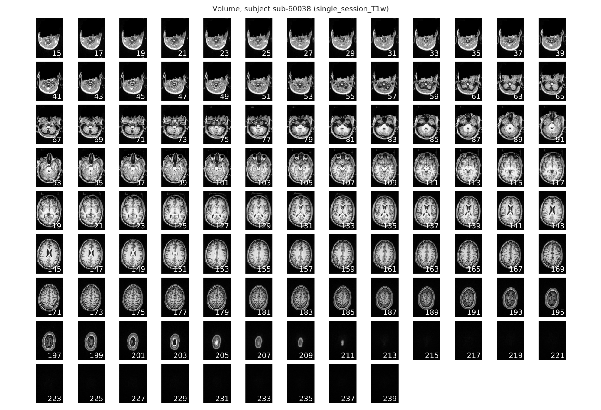
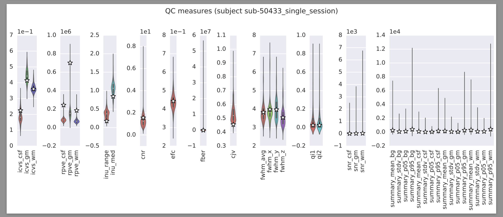
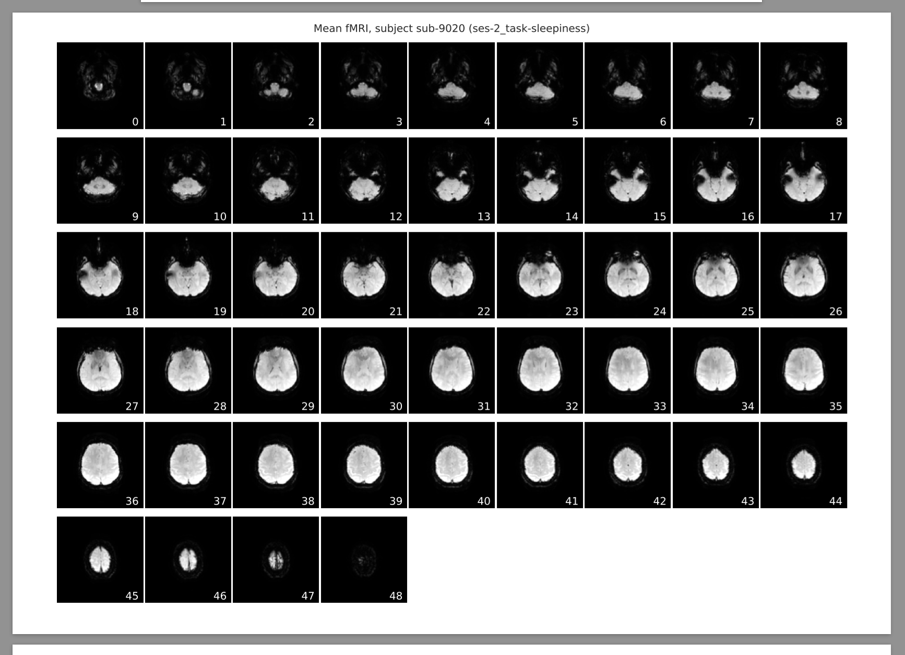
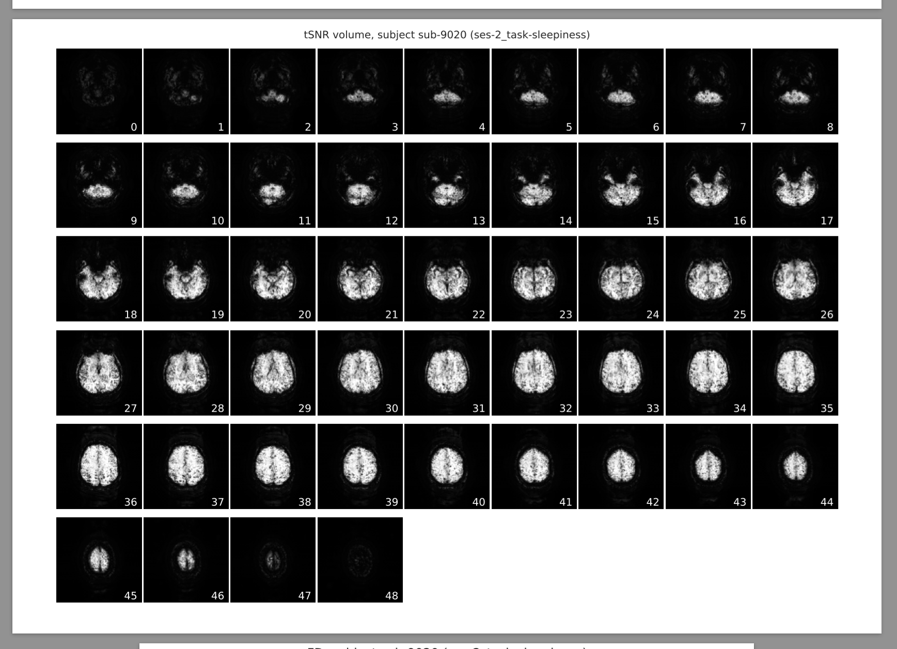
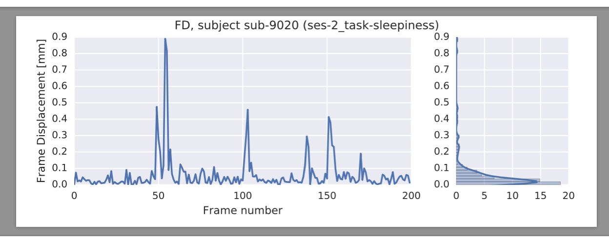
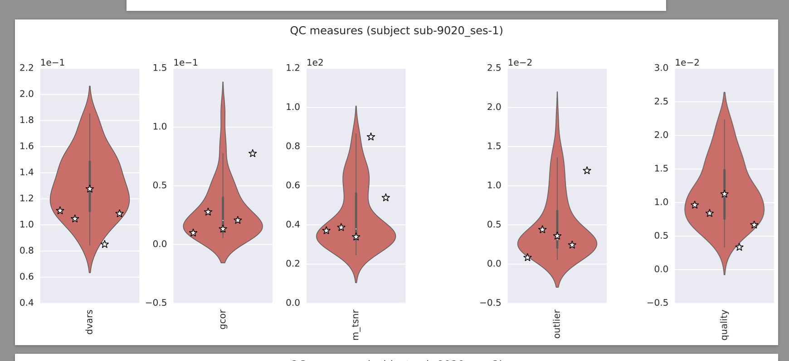
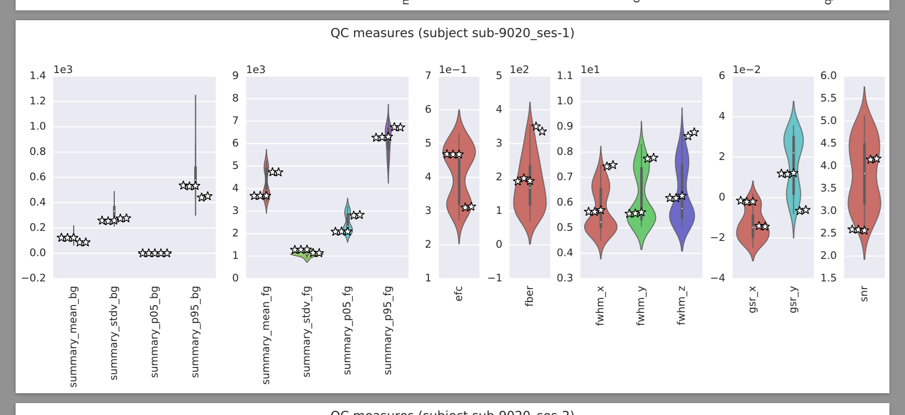

The MRIQC Reports
=================

Structural images (:abbr:`sMRI (structural MRI)`)
-------------------------------------------------

After all processing has been completed, the designated output directory for the ``mriqc`` workflow will contain a set of pdf
files that contain the relevant reports for the set of scans undergoing
quality assessment. The set of output pdfs includes one pdf file per
input scan in the scan directory, e.g.:
``anatomical_sub-01.pdf``, which contains the T1 slice
mosaic and :abbr:`IQMs (image quality metrics)` for that scan. There will also be a group report
pdf in the main output directory, e.g.:
``anatomical_group.pdf``, that contains summary metrics for
the entire set of scans.

For the individual scan reports:
~~~~~~~~~~~~~~~~~~~~~~~~~~~~~~~~

**The T1 Anatomical Slice Mosaic**:
This plot in the report for the scan being assessed, e.g.:

  is the rendering of the axial slices from the 3D stack created
  by the workflow.

This image can be used to eyeball the quality of the overall
signal in the anatomical scan, as it will be obvious if there were any
problem areas where there was signal dropout resulting from a bad shim
or other sources of signal distortion.

**Metrics**: The :abbr:`IQMs (image quality metrics)` displayed in the Summary Report, e.g.:

  The stars in these plots denote where the score for the scans for
  this participant fall in the distribution of all scores for scans that
  were included as inputs to the anatomical-spatial workflow. If there are
  several runs per session for this individual, then the stars will be
  displayed adjacent to each other in the violin plot.

For the group reports:
~~~~~~~~~~~~~~~~~~~~~~

The violin plots included in the group report, e.g.:
``anatomical_group.pdf``, are a graphical representation of
the columnar values in the ``aMRIQC.csv`` file that was
created in the main output directory for the workflow. The scores for
each metric described above were aggregated to create the distributions
that were plotted in both the individual and group reports. Hence, the
violin plots in the individual scan reports and the group reports are
identical, except that the group reports do not contain any stars
denoting individual scans. These group reports are intended to provide
the user a means of visually inspecting the overall quality of the
spatial data for that group of anatomical scans.

Functional images (:abbr:`fMRI (functional MRI)`)
-------------------------------------------------

After all processing has been completed, the designated output directory
for the functional workflow will contain a set of pdf files that contain
the relevant reports for the set of scans undergoing quality assessment.
The set of output pdfs includes one pdf file per input scan, e.g.:
``functional_sub-01.pdf``, which contains a mosaic plot of the
mean :abbr:`EPI (echo-planar imaging)` volume, a mosaic plot of the
:abbr:`tSNR (signal-to-noise ration across timesteps)` volume, an
:abbr:`FD (frame displacement)` plot, and
:abbr:`IQMs (image quality metrics)` for that scan.
The :abbr:`IQMs (image quality metrics)` are split in two
categories: *spatial* and *temporal*. There will also be a group report
pdf in that main output directory, e.g.: ``functional_group.pdf``, that
contains the summary of :abbr:`IQMs (image quality metrics)` for the entire set of scans.

For the individual scan reports:
................................

**The Mean EPI Slice Mosaic**:
This plot in the report for the scan being assessed, e.g.
*Mean EPI image (subject 1_session_1_scan_1)*
is the rendering of the axial slices from the 3D stack created by the
workflow.

  This mean :abbr:`EPI (echo-planar imaging)` was created by averaging
  the :abbr:`BOLD (blood-oxygen-level dependent)` signal intensity values
  in each voxel over time.

  Hence, a 3-dimensional image was created from the 4-dimensional scan
  and was displayed as a slice mosaic.

This image can be used to eyeball the quality of the overall
signal in the scan, as it will be obvious if there were any problem
areas where there was signal dropout resulting from a bad shim or other
sources of signal distortion (such as tattoos which contain metallic or
ferromagnetic compounds, or permanent makeup).

**The tSNR Slice Mosaic**:
The image showing the :abbr:`tSNR (signal-to-noise ration across timesteps)` map for a particular scan, e.g.:
*tSNR volume, subject sub-01 (session_1_func_1)*
is the rendering of the temporal signal-to-noise ratio information from
the scan.

  The :abbr:`tSNR (signal-to-noise ration across timesteps)` plot is similar to the mean :abbr:`EPI (echo-planar imaging)` plot in that both metrics reduce the
  4-dimensional scan to a representative 3-dimensional volume that is then
  split and displayed as a stack of axial (horizontal) slices.
  For this :abbr:`tSNR (signal-to-noise ration across timesteps)` plot, the
  mean of each voxel's timeseries is also computed and is then divided by the
  timeseries standard deviation.
  Hence, the :abbr:`tSNR (signal-to-noise ration across timesteps)` plot
  shows the voxels in which one would expect to have SNR good enough for
  statistical analyses.

Differences in :abbr:`tSNR (signal-to-noise ration across timesteps)` are particularly important for
comparing the results from region of interest (ROI) analyses, since any
observed functional differences might actually be attributable to
systematic differences in :abbr:`SNR (signal-to-noise ratio)` across the regions being compared. You can
learn more about the utility of :abbr:`tSNR (signal-to-noise ration across timesteps)` plots for :abbr:`fMRI (functional MRI)` analyses
`here <http://practicalfmri.blogspot.com.es/2011/01/comparing-fmri-protocols.html>`_.

**The framewise displacement plot**:
The image showing the framewise displacement plot for the scan being
assessed, e.g. *FD, subject sub-01 (session_1_func_1)*
is the :abbr:`FD (frame displacement)` that occurred throughout the scan.

  This is a temporal motion quality assurance metric and tracks head motions over
  time, making it easy to determine whether or not the data potentially
  suffered from significant corruption due to motion. For instance, it is
  possible to detect if the participant's head was slowly sinking into the
  cushions in the head coil, or whether the participant was possibly
  restless or agitated, which would result in several postion changes or
  movement spikes. The framewise displacement is a frame-by-frame
  representation of the differences between the :abbr:`BOLD (blood-oxygen-level dependent)` signal intensity
  value of the :math:`n` and :math:`n+1` timepoints, the :math:`n+1` and :math:`n+2`
  timepoints, and so on.

The report page for :abbr:`FD (frame displacement)` in the functional scan
includes both this frame-by-frame plot, as well as a histogram that can
be used to visually determine what proportion of timepoints exceeded
some pre-set movement threshold (eg: 0.2 mm).

For the group reports:
......................

The violin plots included in the group report, e.g.:
*QC measures (session_1)* are a graphical representation of the
columnar values in the ``fMRIQC.csv`` file that was
created in the main output directory for the workflow.

The scores for
each metric described above were aggregated to create the distributions
that were plotted in both the individual and group reports. Hence, the
violin plots in the individual scan reports and the group reports are
identical, except that the group reports do not contain any stars
denoting individual scans. These group reports are intended to provide
the user a means of visually inspecting the overall quality of the
spatial and temporal data for that group of functional scans.

mriqc.reports package
=====================

Submodules
----------

mriqc.reports.generators module
-------------------------------

.. automodule:: mriqc.reports.generators
    :members:
    :undoc-members:
    :show-inheritance:

mriqc.reports.utils module
--------------------------

.. automodule:: mriqc.reports.utils
    :members:
    :undoc-members:
    :show-inheritance:

Module contents
---------------

.. automodule:: mriqc.reports
    :members:
    :undoc-members:
    :show-inheritance:
