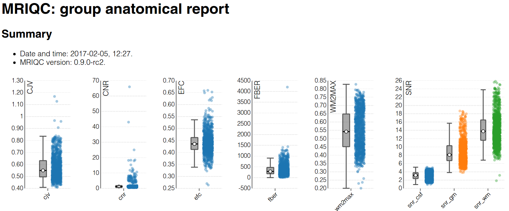
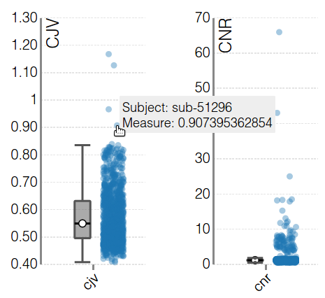

.. _reports-group:

Group reports
=============
Once a sample has been processed with the appropriate
:ref:`workflow <workflows>`, all the :abbr:`IQMs (image quality metrics)`
written out in JSON files are collected in a
:abbr:`CSV (comma separated values)` table, at the standard path
of ``<output-dir>/<modality>.csv``. Therefore, for structural
images, the IQMs will be found in ``<output-dir>/T1w.csv``.
Correspondingly, ``<output-dir>/bold.csv`` is the designated path
for the functional IQM table.

The group report will process the ``<output-dir>/<modality>.csv``
table to generate one strip-plot per IQM:

The strip-plots are interactive, so each sample (the value of a specific
IQM associated to an input image) can be clicked to open up the corresponding
individual report.
This is particularly useful when trying to identify subpar images that
show themselves as outliers in the general distribution of the IQM:

In this example, the corresponding individual report for the selected
sample will open up (`click here to see this example
report <http://web.stanford.edu/group/poldracklab/mriqc/reports/sub-51296_T1w.html>`_).

The boxplots shown are Tukey boxplots, with median and interquartile range shown.
Whiskers extend to the farthest point that is within 1.5 * IQR of the upper (or lower) quartile.
